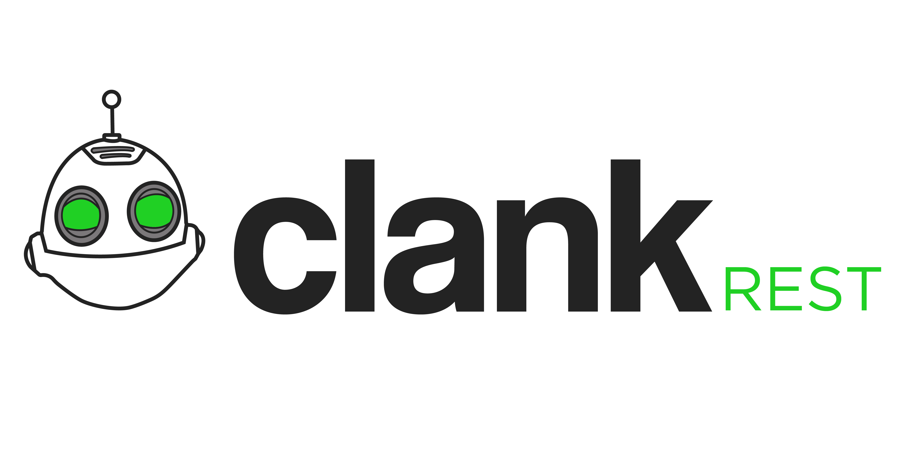

This repository creates a REST API web server for [Clank](https://github.com/hashsploit/clank).

All applicable endpoints follow the CRUD model and can be used to expose the Clank MLS RPC service in a safer way.

Copy the configuration file `config.json.example` to `config.json`.

## Endpoints
| Endpoint                 | Method | Description                                               |
|--------------------------|--------|-----------------------------------------------------------|
| /                        | GET    | Get the clank-rest bridge status and version information. |
| /dmewsc                  | GET    | Reserved for WebSocket live map communication.            |
| /players                 | GET    | Get a list of players connected.                          |
| /players/:id             | GET    | Get information about a specific player by their id.      |
| /worlds                  | GET    | Get a list of worlds.                                     |
| /worlds/:id              | GET    | Get information about a specific world by its id.         |
| /channels                | GET    | Get a list of all channels.                               |
| /channels/:id            | GET    | Get information about a specific channel by its id.       |
| /locations               | GET    | Get a list of all locations.                              |
| /locations/:id           | GET    | Get information about a specific location by its id.      |
| /clans                   | GET    | Get a list of all clans.                                  |
| /clans/:id               | GET    | Get information about a specific clan by its id.          |

## Clank DME WSC
The DME WebSocket Connection is a endpoint that is not built-in to the API but instead part of the `config.nginx` endpoint routing which forwards WebSocket traffic to the Clank DME server.
The purpose of this endpoint is to provide a way for active games to be spectated live via a web-browser.

## Query Parameters

#### GET (any)
- `max_results` [*integer*] A number 1-100 (inclusive) of how many results to return in a single page, by default this is 100.
- `page` [*integer*] A number 0-n specifying the result "page" to return, by default this is 0.

#### GET /players
- `created_before` [*string*] A UNIX timestamp of the oldest that an account should have been created, all accounts created before this time will be shown.
- `created_after` [*string*] A UNIX timestamp of the newest that an account should have been created, all accounts created after this time will be shown.
